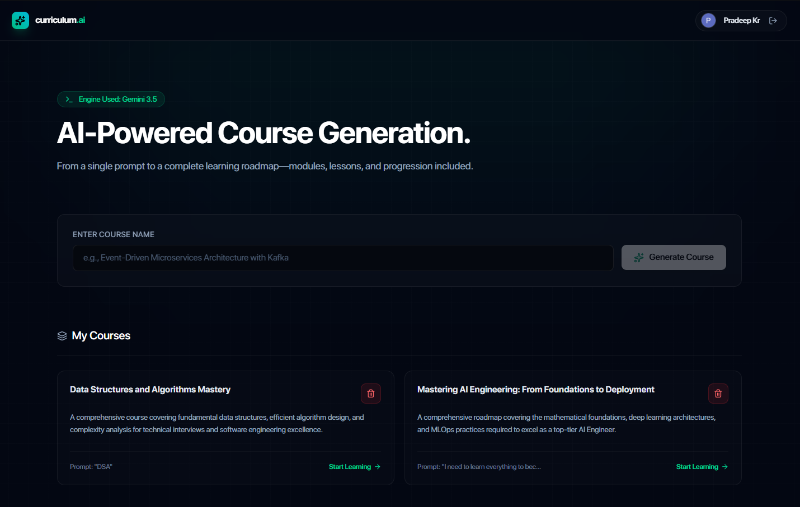
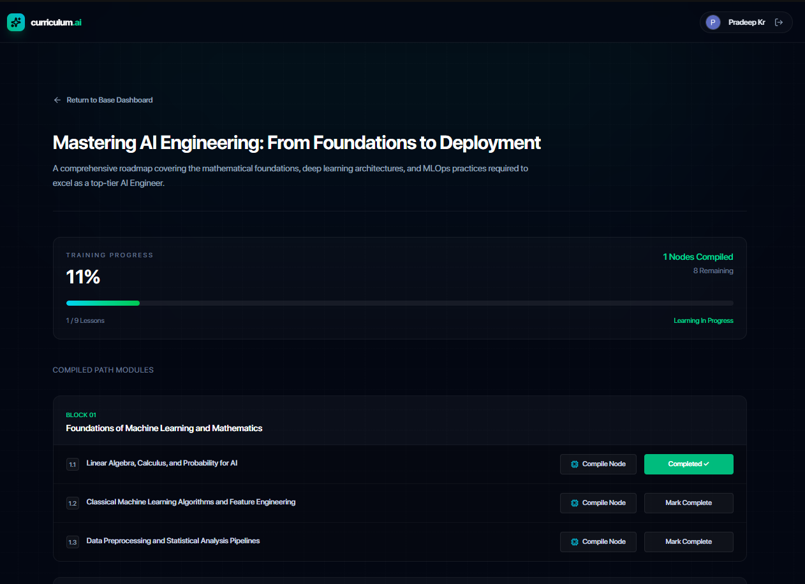
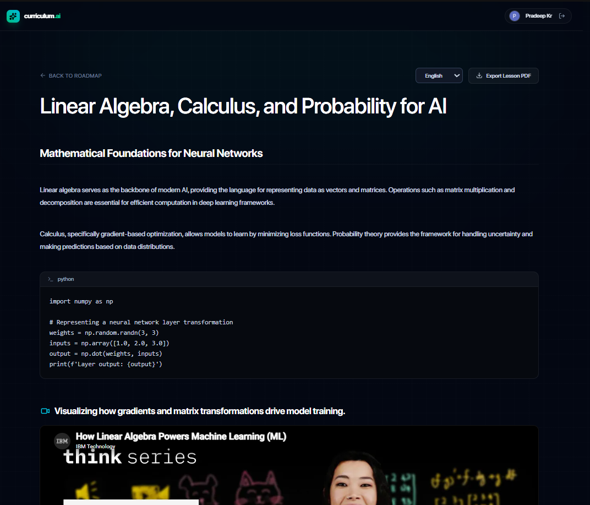
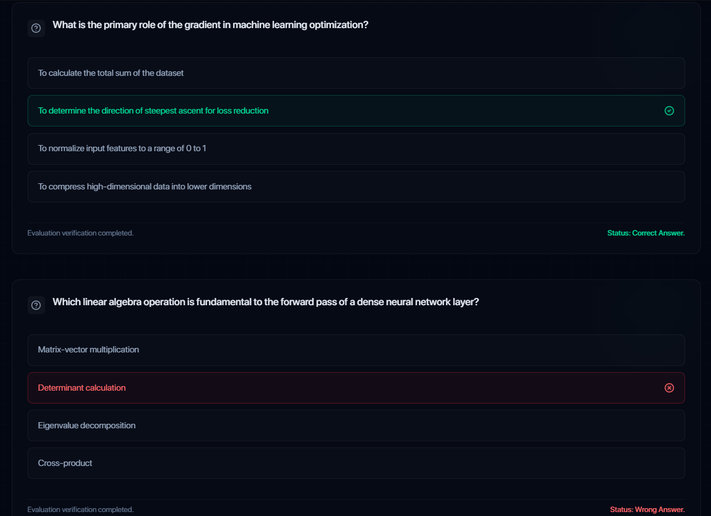
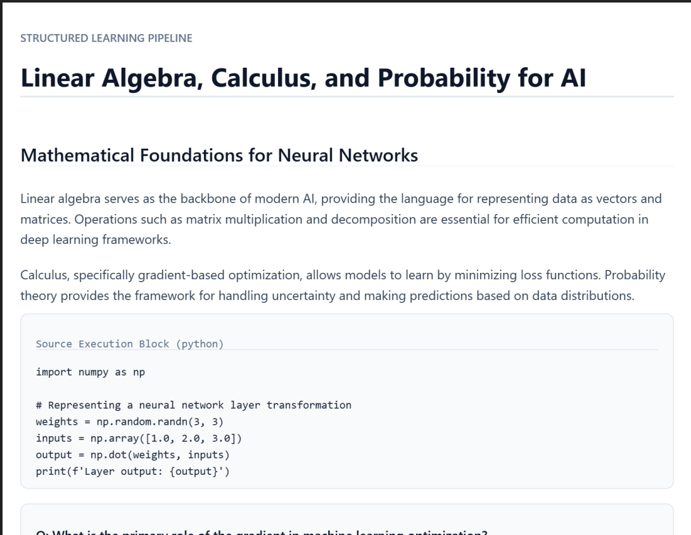

# 📚 Text-to-Learn

### AI Powered Course Generator

Generate complete learning courses from any topic using Gemini AI.

The application automatically creates structured courses consisting of modules, lessons, objectives, code examples, quizzes, YouTube resources, and downloadable PDFs.

---

## 🚀 Live Demo

**Application:** https://ai-course-generator-fawn.vercel.app/

---

## ✨ Features

- 🤖 AI-generated course creation
- 📖 Structured modules and lessons
- 🎯 Learning objectives for every lesson
- 💻 Code examples where applicable
- ❓ Interactive MCQs
- 🎥 Related educational YouTube videos
- 📄 Download lessons as PDF
- 🔐 Secure authentication using Auth0
- 💾 Save and revisit generated courses
- 📱 Responsive modern UI

---

## 🛠 Tech Stack

### Frontend

- React
- Vite
- Tailwind CSS
- React Router
- Axios

### Backend

- Node.js
- Express.js
- MongoDB
- Mongoose

### AI

- Google Gemini API

### Authentication

- Auth0

### Other Libraries

- jsPDF
- html2canvas
- YouTube Data API

---

## 🏗 Architecture

```

User
│
▼

React Frontend
│
▼

Express Backend
│
▼

Gemini API
│
├──────────────► MongoDB
│
▼

Generated Course
│
▼

Frontend Rendering

```

---

## 📂 Project Structure

```

project/
│
├── client/
│ ├── src/
│ ├── components/
│ ├── pages/
│ ├── hooks/
│ ├── context/
│ └── utils/
│
├── server/
│ ├── controllers/
│ ├── routes/
│ ├── models/
│ ├── middleware/
│ ├── services/
│ ├── config/
│ └── utils/

```

---

## ⚙️ Workflow

1. User enters a topic.
2. Frontend sends the request to the backend.
3. Backend constructs an optimized Gemini prompt.
4. Gemini generates a structured course outline.
5. Course is validated and stored in MongoDB.
6. Frontend displays the generated modules.
7. Lessons are generated dynamically when opened.
8. Users can save courses and download lessons as PDFs.

---

## 📸 Screenshots

### Home Page



---

### Generated Course



---

### Lesson Viewer



---

### Quiz



---

### PDF Export



---

## ⚡ Installation

### 1. Clone the repository

```bash
git clone https://github.com/Pradeep4157/YOUR_REPO_NAME.git
cd YOUR_REPO_NAME
```

### 2. Backend Setup

Navigate to the server directory and install the required dependencies.

```bash
cd server
npm install
```

Create a `.env` file inside the `server` directory and add the following environment variables:

```env
PORT=
MONGO_URI=
JWT_SECRET=
GOOGLE_CLIENT_ID=
YOUTUBE_API_KEY=
CLIENT_URL=
GEMINI_API_KEY=
```

Start the backend server:

```bash
npm run dev
```

The backend will start on the port specified in your `.env` file (e.g., `http://localhost:5000`).

---

### 3. Frontend Setup

Open a new terminal and navigate to the client directory.

```bash
cd client
npm install
```

Start the React development server:

```bash
npm run dev
```

The frontend will be available at:

```
http://localhost:5173
```

---

### 4. You're Ready!

Ensure that both the frontend and backend servers are running. Open your browser and navigate to:

```
http://localhost:5173
```

to start using the application.

---

## 🔑 Environment Variables

### Backend

```

PORT=5000
MONGO_URI=your_mongodb_connection_string
JWT_SECRET=your_jwt_secret
GOOGLE_CLIENT_ID=your_google_client_id
YOUTUBE_API_KEY=your_youtube_api_key
CLIENT_URL=http://localhost:5173
GEMINI_API_KEY=your_gemini_api_key

```

## 💡 Challenges Faced

- Designing prompts that consistently produce structured JSON.
- Validating AI responses before rendering.
- Rendering dynamic lesson content from JSON.
- Managing API token usage efficiently.
- Integrating authentication with protected APIs.

---

## 📈 Future Improvements

- Course completion certificates
- AI chatbot for every lesson
- Flashcards
- Voice explanations (TTS)

---

## 📚 Learnings

Building this project strengthened my understanding of full-stack application development, REST API design, prompt engineering, AI integration, dynamic UI rendering, authentication, MongoDB schema design, and deployment of production-ready AI applications.

---
